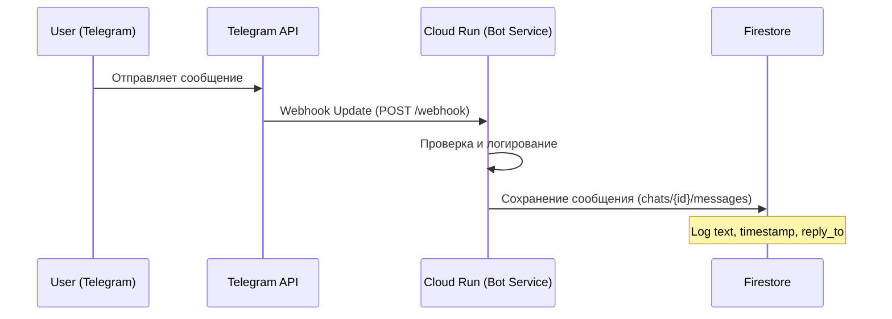
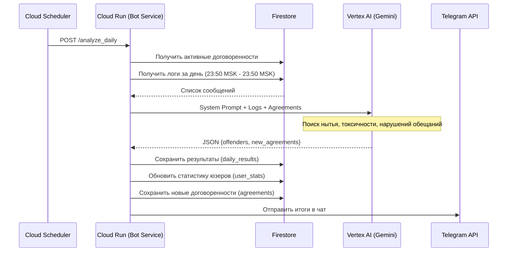

# Архитектура Snitch Bot (Снитч-бот)

## 1. Обзор
Telegram-бот для дружеских чатов, который анализирует переписку участников и ежедневно выбирает "Снитча дня" (главного нарушителя спокойствия) с использованием AI. Также ведет статистику и отслеживает договоренности.

## 2. Технологический стек
*   **Язык:** Python 3.11+
*   **Фреймворк:** FastAPI (Webhooks & Endpoints) + Aiogram 3.x (Bot Logic)
*   **Хостинг:** Google Cloud Run (Serverless)
*   **База данных:** Google Cloud Firestore (NoSQL)
*   **AI Engine:** Vertex AI (Gemini 3 Flash Preview)
*   **Планировщик:** Google Cloud Scheduler (для ежедневных задач) + APScheduler (для локальных задач)

## 3. Схема работы (Data Flow)

### A. Обработка сообщений (Real-time)

### B. Анализ "Снитча дня" (Daily Job)

## 4. Схема Базы Данных (Firestore)

### Collection: `chats`
Документы по `chat_id`.
*   `active`: boolean (флаг активности бота)

#### Sub-collection: `messages`
Логи всех сообщений.
*   Document ID: `message_id`
*   Fields:
    *   `user_id`: int
    *   `username`: string
    *   `full_name`: string
    *   `text`: string
    *   `timestamp`: datetime
    *   `date_key`: string ("YYYY-MM-DD")
    *   `reply_to`: int (optional)
    *   `is_reported`: boolean (optional)
    *   `report_reason`: string (optional)

#### Sub-collection: `daily_results`
Результаты ежедневного анализа.
*   Document ID: `date_key` ("YYYY-MM-DD")
*   Fields:
    *   `offenders`: list of objects (user_id, points, reason, etc.)
    *   `new_agreements`: list of objects
    *   `date_key`: string

#### Sub-collection: `user_stats`
Накопленная статистика пользователей.
*   Document ID: `user_id`
*   Fields:
    *   `season_id`: string ("global")
    *   `total_points`: int
    *   `snitch_count`: int (количество дней с нарушениями)
    *   `current_rank`: string
    *   `last_title`: string
    *   `last_win_date`: string
    *   `username`: string

#### Sub-collection: `agreements`
Договоренности, отслеживаемые ботом.
*   Document ID: auto-generated
*   Fields:
    *   `text`: string
    *   `users`: list of strings (names)
    *   `created_at`: timestamp
    *   `status`: string ("active")

## 5. Система "Snitch Points"

### Категории и Очки
*   **Нытье (Whining):** 10 очков
*   **Духота (Stiffness):** 15 очков
*   **Кринж (Cringe):** 20 очков
*   **Токсичность (Toxicity):** 25 очков
*   **Предательство (Betrayal):** 50 очков

### Ранги
*   **0-49:** Порядочный 😐
*   **50-249:** Шнырь 🧹
*   **250-749:** Козёл 🐐
*   **750-1499:** Обиженный 🚽
*   **1500+:** Масть Проткнутая 👑

## 6. API Endpoints
*   `POST /webhook`: Прием обновлений от Telegram.
*   `POST /analyze_daily`: Триггер ежедневного анализа (требует `X-Secret-Token`).
*   `POST /weekly_decay`: Триггер еженедельной амнистии (требует `X-Secret-Token`).
*   `GET /`: Health check.
