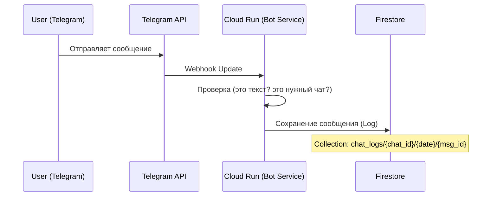
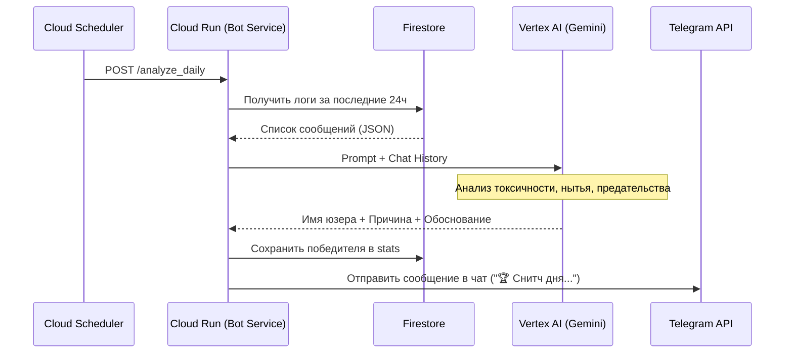

# Архитектура Snitch Bot (Снитч-бот)

## 1. Обзор
Telegram-бот для дружеских чатов, который анализирует переписку участников и ежедневно выбирает "Снитча дня" (главного мудака/уебана) с использованием AI. Также ведет статистику за неделю и месяц.

## 2. Технологический стек
*   **Язык:** Python 3.11+
*   **Фреймворк:** Aiogram 3.x (асинхронный)
*   **Хостинг:** Google Cloud Run (Containerized application)
*   **База данных:** Google Cloud Firestore (NoSQL)
*   **AI Engine:** Vertex AI (Gemini 1.5 Flash / 2.0 Flash)
*   **Планировщик:** Google Cloud Scheduler (для ежедневных джоб)

## 3. Схема работы (Data Flow)

### A. Обработка сообщений (Real-time)


### B. Анализ "Снитча дня" (Daily Job)


## 4. Схема Базы Данных (Firestore)

### Collection: `chats`
Документы по `chat_id`.
*   `active`: boolean
*   `settings`: Map (язык, уровень токсичности и т.д.)

### Collection: `logs` (Sub-collection inside `chats` or root with `chat_id` field)
Структура для экономии чтений/записи: `chats/{chat_id}/daily_logs/{date_string}`
Внутри документа массив `messages`:
```json
{
  "messages": [
    {
      "user_id": 12345,
      "username": "ivan_durak",
      "text": "ненавижу вас всех",
      "timestamp": "2024-05-20T10:00:00Z",
      "reply_to": 67890
    }
  ]
}
```
*Примечание: Firestore имеет лимит 1MB на документ. Если чат очень активный, придется разбивать на шарды (sharding) или писать каждое сообщение отдельным документом (дороже).*
*Решение:* Пишем каждое сообщение отдельным документом в `chats/{chat_id}/messages/`. TTL (Time-to-Live) policy удаляет их через 3 дня.

### Collection: `stats`
`chats/{chat_id}/stats/{user_id}`
*   `snitch_count_day`: int
*   `snitch_count_week`: int
*   `snitch_count_month`: int
*   `last_win_date`: timestamp
*   `titles`: array ["Главный нытик", "Крыса"]

## 5. Промпт для Gemini (Концепт)
**System Prompt:**
> Ты — циничный, саркастичный и наблюдательный судья в чате друзей. Твоя задача — прочитать историю переписки за день и выбрать "Снитча дня" (Snitch of the Day).
>
> Критерии:
> 1. Кто больше всех ныл?
> 2. Кто подставил друга или "сдал" его?
> 3. Кто был токсичным без причины?
> 4. Кто постил кринж?
> 5. Нарушение договоренностей и опоздания.
> 6. Игнор сообщений (read but no reply) при прямом обращении.
>
> Формат ответа:
> 1. Имя победителя (username).
> 2. Титул (например, "Герцог Духоты").
> 3. Обоснование (смешное и обидное, 2-3 предложения).
>
> Не будь слишком вежливым. Это чат друзей, они любят жесткий юмор.

## 6. План разработки
1.  **Настройка GCP:** Создать проект, включить API (Vertex AI, Firestore, Cloud Run, Cloud Build).
2.  **Bot Skeleton:** Aiogram, Webhook handler.
3.  **DB Layer:** Функции для записи сообщений и чтения истории.
4.  **AI Layer:** Интеграция с Vertex AI SDK.
5.  **Scheduler:** Эндпоинт для триггера анализа.
6.  **Deploy:** Dockerfile + deploy script.
