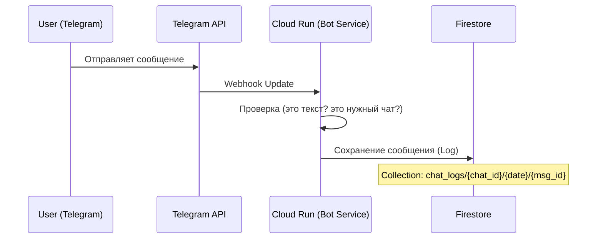
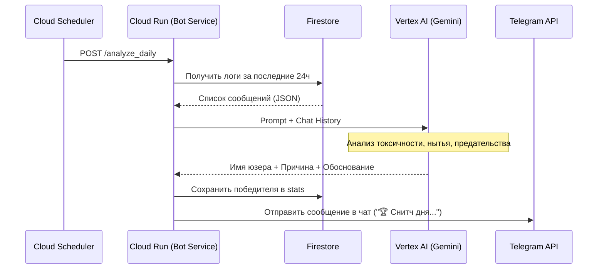

# Архитектура Snitch Bot (Снитч-бот)

## 1. Обзор
Telegram-бот для дружеских чатов, который анализирует переписку участников и ежедневно выбирает "Снитча дня" (главного мудака/уебана) с использованием AI. Также ведет статистику за неделю и месяц.

## 2. Технологический стек
*   **Язык:** Python 3.11+
*   **Фреймворк:** Aiogram 3.x (асинхронный)
*   **Хостинг:** Google Cloud Run (Containerized application)
*   **База данных:** Google Cloud Firestore (NoSQL)
*   **AI Engine:** Vertex AI (Gemini 1.5 Flash / 2.0 Flash)
*   **Планировщик:** Google Cloud Scheduler (для ежедневных джоб)

## 3. Схема работы (Data Flow)

### A. Обработка сообщений (Real-time)


### B. Анализ "Снитча дня" (Daily Job)


## 4. Схема Базы Данных (Firestore)

### Collection: `chats`
Документы по `chat_id`.
*   `active`: boolean
*   `settings`: Map (язык, уровень токсичности и т.д.)

### Collection: `logs` (Sub-collection inside `chats` or root with `chat_id` field)
Структура для экономии чтений/записи: `chats/{chat_id}/daily_logs/{date_string}`
Внутри документа массив `messages`:
```json
{
  "messages": [
    {
      "user_id": 12345,
      "username": "ivan_durak",
      "text": "ненавижу вас всех",
      "timestamp": "2024-05-20T10:00:00Z",
      "reply_to": 67890
    }
  ]
}
```
*Примечание: Firestore имеет лимит 1MB на документ. Если чат очень активный, придется разбивать на шарды (sharding) или писать каждое сообщение отдельным документом (дороже).*
*Решение:* Пишем каждое сообщение отдельным документом в `chats/{chat_id}/messages/`. TTL (Time-to-Live) policy удаляет их через 3 дня.

### Collection: `stats`
`chats/{chat_id}/user_stats/{user_id}`
*   `snitch_count`: int (количество побед)
*   `total_points`: int (сумма очков-снитча)
*   `current_rank`: string (текущее звание, например "Дипломированная Крыса")
*   `last_win_date`: timestamp
*   `last_title`: string

## 5. Система "Snitch Points" и Ранги

### Классификация и Очки
AI анализирует поведение и присваивает категорию с очками:
*   **Нытье (Whining):** 10 очков
*   **Духота (Stiffness):** 15 очков
*   **Кринж (Cringe):** 20 очков
*   **Токсичность (Toxicity):** 25 очков
*   **Предательство (Betrayal):** 50 очков

### Ранги (Звания)
Звания зависят от `total_points`:
*   0-99: Начинающий Снитч
*   100-499: Дипломированная Крыса
*   500-999: Мастер Токсичности
*   1000+: Гранд-Снитч / Бог Снитчей

## 6. Промпт для Gemini (Обновленный)
**System Prompt:**
> Ты — циничный судья. Твоя задача — выбрать "Снитча дня" и классифицировать его проступок.
>
> Классификация (выбери одну):
> 1. Whining (Нытье) - 10 pts
> 2. Stiffness (Духота) - 15 pts
> 3. Cringe (Кринж) - 20 pts
> 4. Toxicity (Токсичность) - 25 pts
> 5. Betrayal (Предательство) - 50 pts
>
> Если явного лидера нет, выбери самого "кринжового" или "душного".
>
> Верни JSON:
> {
>   "user_id": 12345,
>   "username": "nickname",
>   "category": "Toxicity",
>   "points": 25,
>   "daily_title": "Герцог Духоты",
>   "reason": "..."
> }

## 6. План разработки
1.  **Настройка GCP:** Создать проект, включить API (Vertex AI, Firestore, Cloud Run, Cloud Build).
2.  **Bot Skeleton:** Aiogram, Webhook handler.
3.  **DB Layer:** Функции для записи сообщений и чтения истории.
4.  **AI Layer:** Интеграция с Vertex AI SDK.
5.  **Scheduler:** Эндпоинт для триггера анализа.
6.  **Deploy:** Dockerfile + deploy script.
